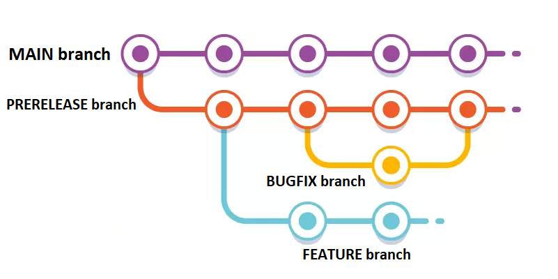

## ABOUT THE PROJECT
    - Software enginnering Vilnius university project
    - Objective: better tools for education

## TEAM BET_KOKS
    1. Kipras Šaparauskas
    2. Balys Žalneravičius
    3. Dominykas Misius

## OUR IDEA - ONLINE NOTES
    Hard to keep up with every university lecture? - No problem.
    We are developing a web application using Microsoft .NET, aimed at facilitating collaborative note-taking for individuals attending lectures.

## BRANCHING STRATEGY

## BRANCH NAMING
    main - official realese.
    prerelease - working branch.

    <person name> - <feature / bugfix / test> - <specification>

